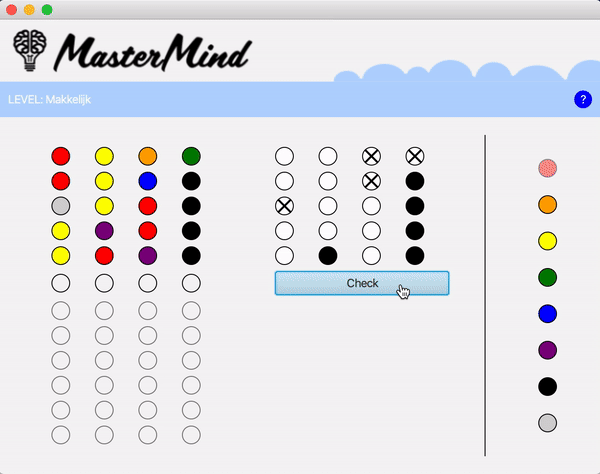
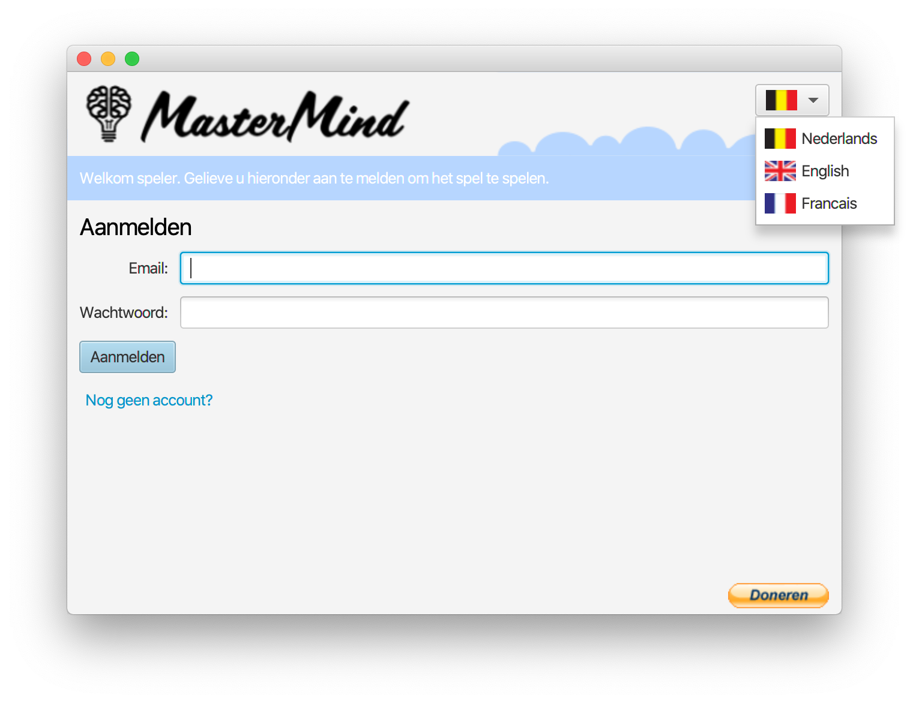
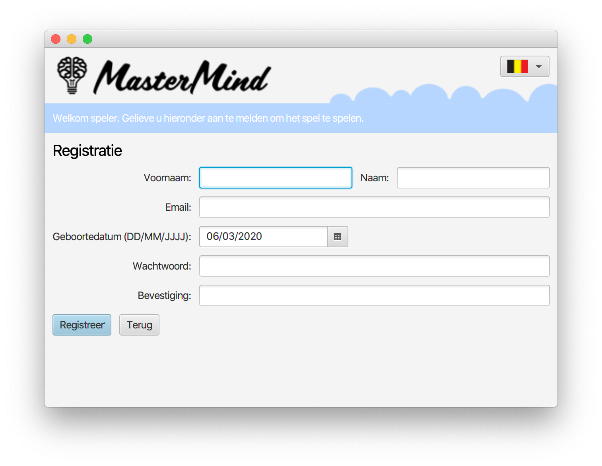
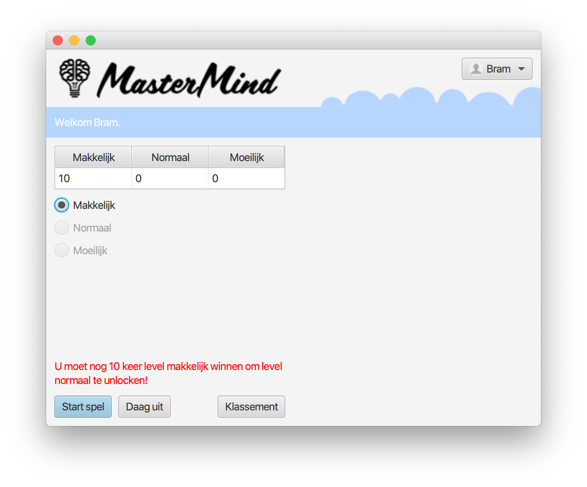
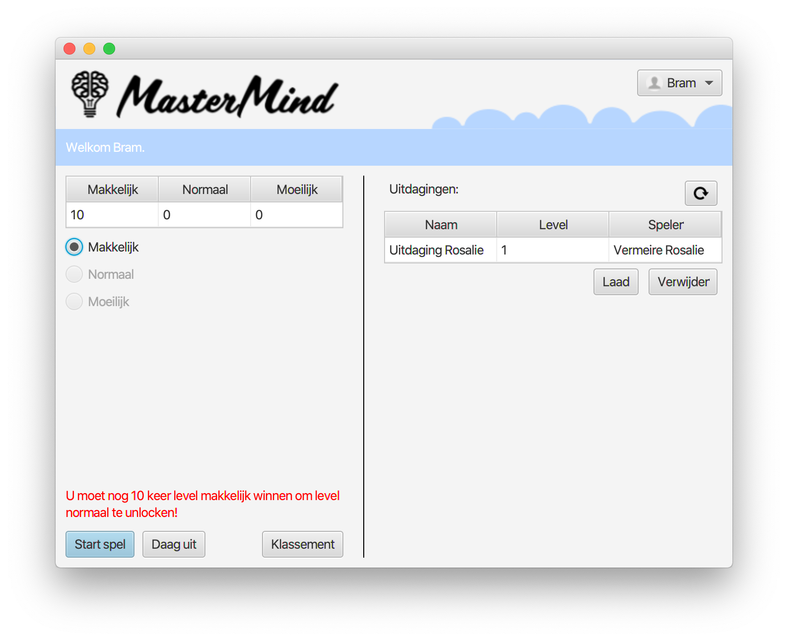
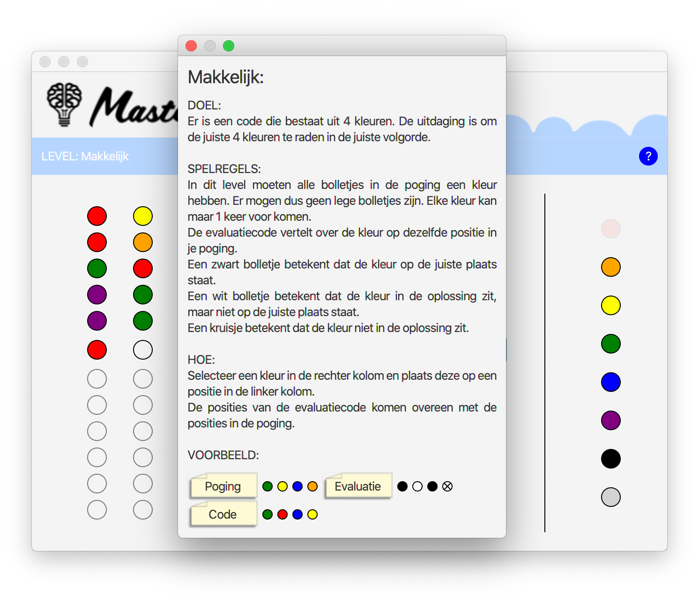
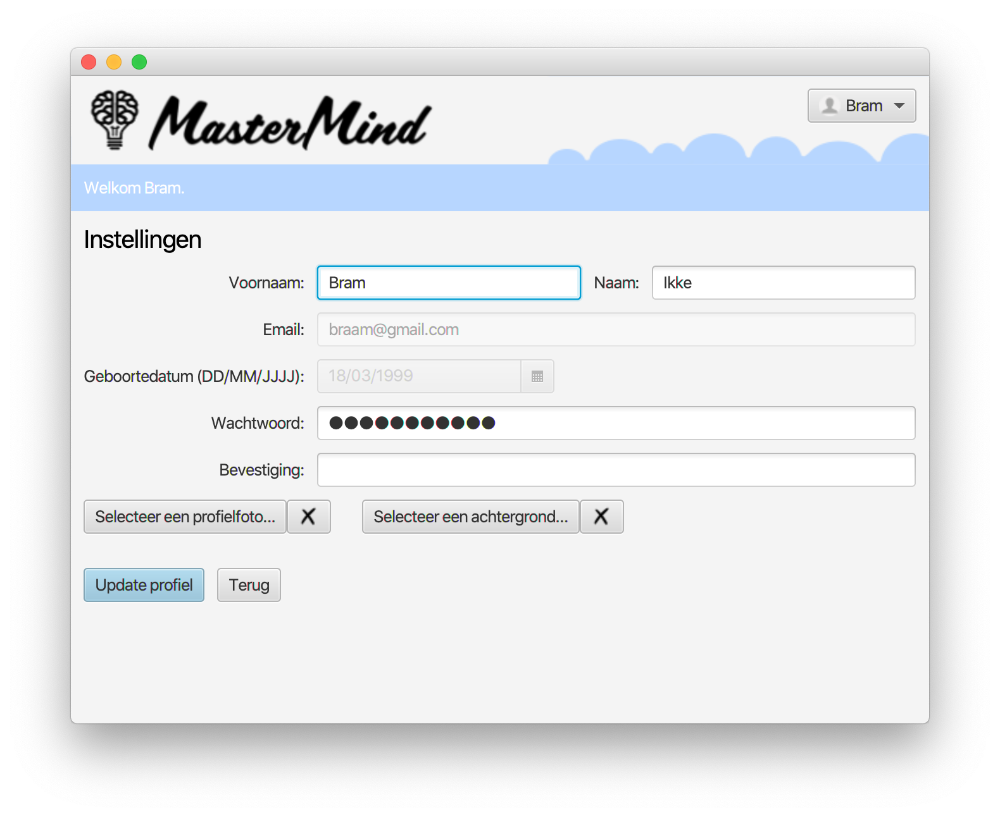

# Mastermind - JavaFX
 &nbsp;

This is a javafx based project. This project is made in 2018 with some friends in school. I was a beginning programmer. My friends were the game analysts and testers and I was the programmer. We had a lot of fun making this project.

## Description

This project is made with Java 9.  
It's based on the Mastermind party game.  
Mastermind is a code-breaking game. A secret code is made at the start of each game. It's up to you to find the secret pattern in both order and color within twelve turns.
The secret code is made out of 8 different colors. Once placed, the game gives feedback by placing black, white or crossed circles. 

There are 3 difficulty levels (easy, normal and difficult). And you can even challenge other players.  
The game is available in 3 different languages (Dutch, French and English).

## Screenshots

 

 

 

# Extra

For more information, go to: [www.bramgoedvriend.be](http://bramgoedvriend.be/).  
You can find me on [Facebook](https://www.facebook.com/braampje.goedvriend) and [LinkedIn](https://www.linkedin.com/in/bramgoedvriend/).
